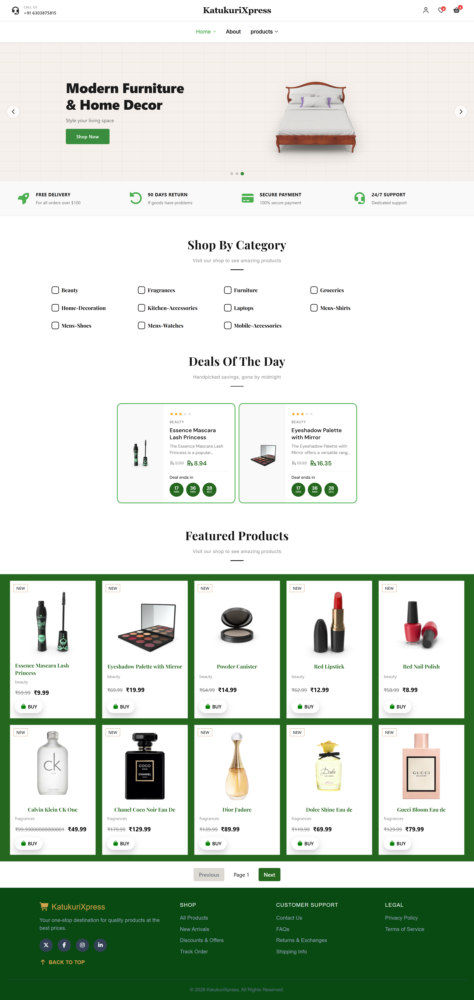
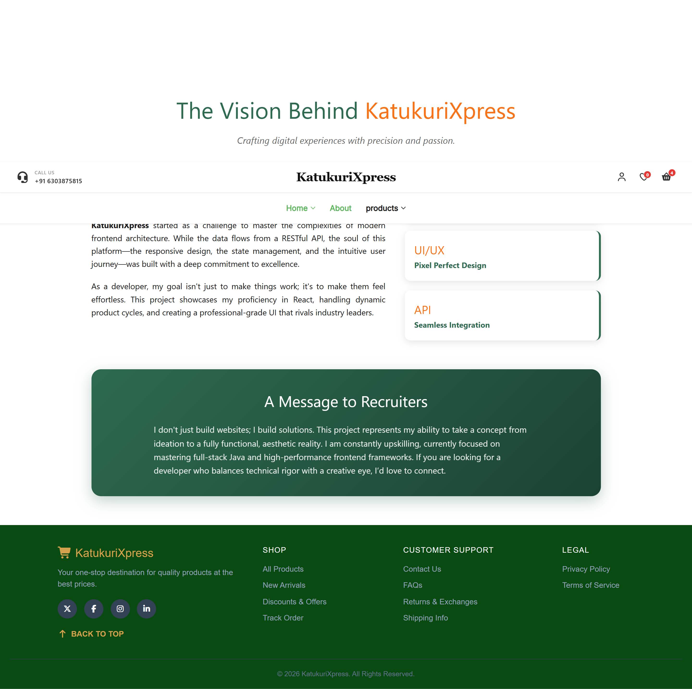
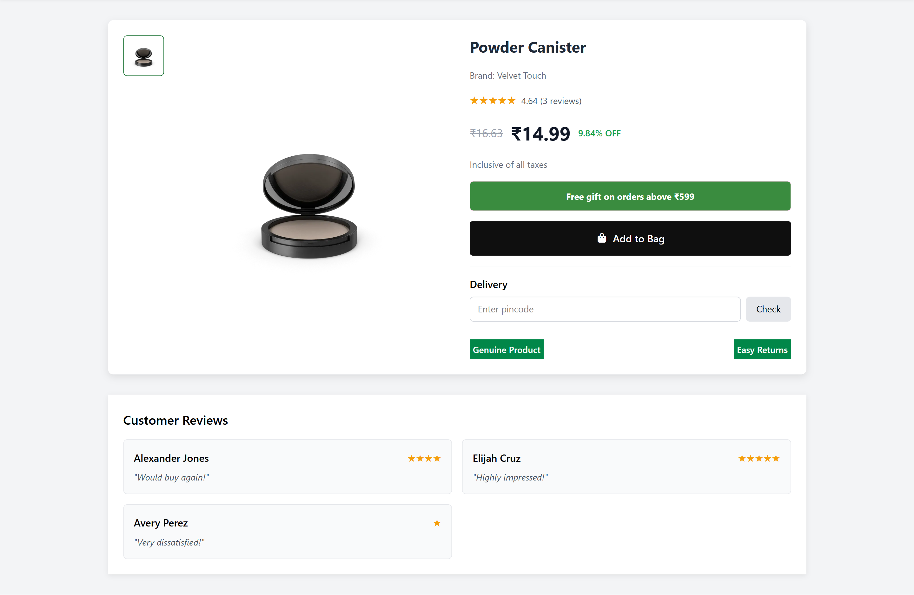

<div align="center">

<br/>


<br/><br/>

# 🛍️ KatukuriXpress

**A modern, production-grade e-commerce web app built with React 18, Redux, and Vite.**

[🌐 Live Demo](https://katukurixpress.vercel.app/) &nbsp;·&nbsp; [📁 GitHub Repo](https://github.com/katukurijaswanth2/KatukuriXpress)

<br/>

</div>

---

## 📸 Preview

<div align="center">
  
  <sub><b>🏠 Home — Dynamic product listings with real-time deals</b></sub>
</div>

<br/>

---

## 📖 About

**KatukuriXpress** goes beyond a basic storefront. It features API-driven product listings, Redux-powered cart state, skeleton UI loading screens, a live deal countdown timer, and a clean feature-based architecture — all built following modern React best practices.

---

## ✨ Features

| | Feature | Description |
|---|---|---|
| 🛍️ | **Product Listing** | Fetches and renders products dynamically from an external REST API |
| 🔎 | **Category Filtering** | Filter products by category with a modular, reusable filter UI |
| 🛒 | **Cart Management** | Add, remove, and update quantities — state managed globally via Redux |
| ⭐ | **Rating System** | Star ratings rendered on product and deal cards |
| ⏳ | **Skeleton Loaders** | Content-shaped skeleton screens that match the exact layout being loaded |
| 🎯 | **Deals of the Day** | Time-limited deal cards with a live countdown timer |
| 🔐 | **Authentication UI** | Login and Sign-Up pages with form handling |
| 📱 | **Fully Responsive** | Mobile-first layout that works seamlessly across all screen sizes |
| 🔄 | **Custom Hooks** | All API calls and loading/error state are encapsulated in reusable hooks |

---

## 🧠 Tech Stack

| Layer | Technology |
|---|---|
| **Framework** | React 18 + Vite |
| **Routing** | React Router DOM |
| **State Management** | Redux Toolkit |
| **Styling** | Modular CSS (per-component stylesheets) |
| **Data Fetching** | Fetch API + custom async hooks |
| **Deployment** | Vercel |

---

## 🗂️ Project Structure

Feature-based folder structure — each feature owns its components, pages, and styles. Shared UI lives in a dedicated layer and business logic is extracted into utilities and hooks.

```
src/
├── app/                        # App entry point (App.jsx, main.jsx, global CSS)
├── appRouterDom/               # Route definitions
├── assets/                     # Static images, SVGs, JS utilities
├── coustomHocks/               # Reusable custom React hooks (API calls, state logic)
│
├── features/                   # Core feature modules
│   ├── Deals/                  # Deals of the Day
│   │   ├── pages/              # DealsOfTheDay page
│   │   ├── CountdownTimer.jsx  # Live countdown component
│   │   ├── DealCard.jsx
│   │   └── StarRating.jsx
│   │
│   ├── authontication/         # Login & Sign-Up UI
│   │   ├── Login.jsx
│   │   └── SignIn.jsx
│   │
│   ├── cart/                   # Cart feature
│   │   ├── components/         # CartCard, PriceSummary, QtySelector, etc.
│   │   └── CartPage.jsx
│   │
│   └── products/               # Product listing feature
│       ├── components/         # ProductCard, ProductGrid, Products
│       └── skeleton/           # ProductsSkeleton, SpecificCardSkeleton
│
├── mainLayout/                 # App shell / layout wrapper
├── pages/                      # Top-level pages (Home, AllProducts, About)
├── reduX/                      # Redux store, slices, actions
│
├── shared/                     # Shared across features
│   ├── components/             # Navbar, Footer, Carousel, Features section
│   └── ui/                     # Pagination, SectionHeader, SpecificCard
│
└── utilities/                  # Business logic helpers
    └── category/               # Category filter logic and components
```

---

## ⚡ React Concepts Applied

**Custom Hooks** — All API calls and derived loading/error state are extracted into hooks inside `coustomHocks/`, keeping components clean and logic reusable across the app.

**Skeleton Loading Strategy** — Instead of generic spinners, the app renders content-shaped skeleton screens (`ProductsSkeleton`, `SpecificCardSkeleton`) that match the exact layout of the content being loaded — dramatically improving perceived performance.

**Redux for Cart State** — Add, remove, and quantity update operations are handled globally via Redux, making cart state accessible from any component without prop drilling.

**Feature-Based Architecture** — Each feature (`cart`, `products`, `Deals`, `authontication`) is fully self-contained with its own components, pages, and styles — enabling independent development and scaling.

---

## 📸 More Screenshots

<div align="center">
  
  <sub><b>ℹ️ About — Brand story and feature highlights</b></sub>
</div>

<br/>

<div align="center">
  
  <sub><b>🛒 Cart — Item management with live price summary</b></sub>
</div>

---

## 🚀 Getting Started

**Prerequisites:** Node.js v16+, npm

```bash
# 1. Clone the repository
git clone https://github.com/katukurijaswanth2/KatukuriXpress.git

# 2. Navigate into the project
cd KatukuriXpress

# 3. Install dependencies
npm install

# 4. Start the development server
npm run dev
```

App runs at **`http://localhost:5173`**

---

## 📬 Contact

**Jaswanth Katukuri** — Full Stack Developer

GitHub: [@katukurijaswanth2](https://github.com/katukurijaswanth2)

---

